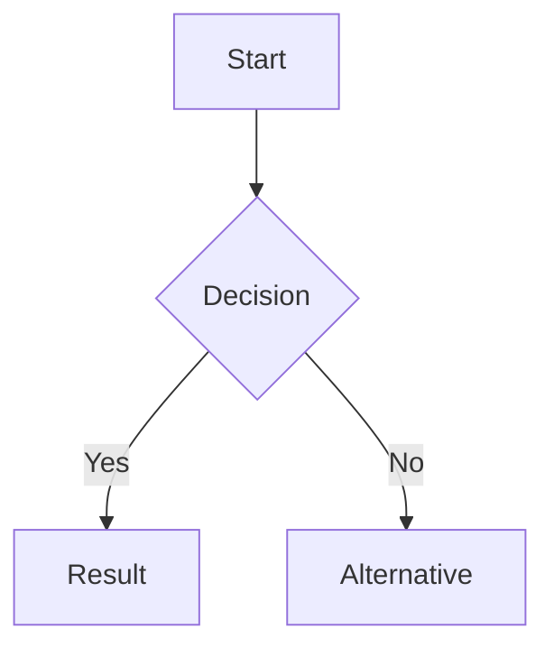
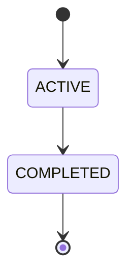
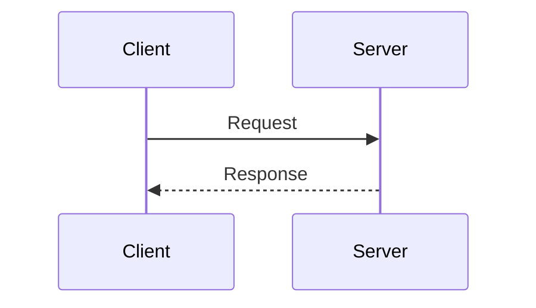
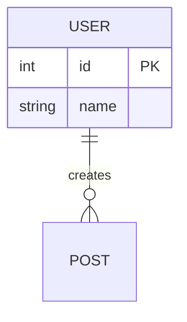
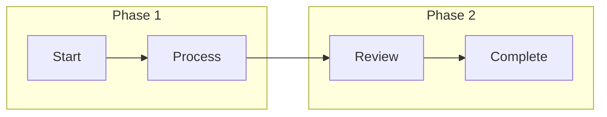

# PARA — Mermaid Diagram Best Practices

> **Goal**: Create error-free Mermaid.js diagrams in your second brain notes.
> Every character restriction below prevents real rendering errors.

---

## 1. CRITICAL: Character Restrictions

These cause the MOST errors. Always check before finalizing any diagram.

### Node Text Restrictions (All Diagram Types)

| Forbidden | Replace With | Why |
|-----------|-------------|-----|
| `"1. Step Name"` | `"Step Name - Regular"` | Number + dot = markdown list, causes "Unsupported markdown: list" |
| `"1a. Detail"` | `"Detail - Variant"` | Same as above |
| `"Line1\nLine2"` | `"Line1 - Line2"` | Backslash-n renders as literal `\n` in node, not a newline |
| `"Confirm & Send"` | `"Confirm and Send"` | Ampersand = HTML entity |
| `"20% off"` | `"20 percent off"` | Percent = comment character |
| `"Yes/No"` | `"Yes or No"` | Slash = path separator |
| `Tap "Extend"` | `Tap Extend` | Double quotes conflict with node delimiter |
| `"Line <br> break"` | `"Line - break"` | Angle brackets = HTML |

### Universal Restrictions

Never use these ANYWHERE in Mermaid code:
- Backslash `\` (except for comments)
- Angle brackets `<` `>`
- Backtick `` ` ``
- Pipe `|` (except in table/edge syntax)
- Emoji inside nodes (use text only)

---

## 2. Quick Check Before Finalizing

```
[ ] Any "1.", "1a.", "2." at start of node text? → REPLACE
[ ] Any "\n" (backslash-n) in node text? → REPLACE with " - "
[ ] Any double quotes "..." inside labels? → REMOVE
[ ] Any "&" in text? → REPLACE with "and"
[ ] Any "%" in text? → REPLACE with "percent"
[ ] Any "/" in text? → REPLACE with "or"
[ ] Any emoji in nodes? → REPLACE with text
[ ] Any backticks `` ` `` in labels? → REMOVE
```

---

## 3. Pattern Library

### Flowchart — For processes and decisions


### State Diagram — For lifecycles and status flows


### Sequence Diagram — For interactions and APIs


### ER Diagram — For data models


---

## 4. Direction Rules

| Code | Direction | Best For |
|------|-----------|----------|
| `TD` / `TB` | Top to Bottom | Long vertical flows (>8 steps), detailed processes |
| `LR` | Left to Right | Comparisons, sub-flows, horizontal space |

---

## 5. Subgraph — Group Related Nodes



Use subgraphs to:
- Separate phases or stages
- Group by actor or system
- Distinguish existing vs new components

---

## 6. Node Naming Convention

Use UPPER_SNAKE_CASE for state/node IDs:
```
✅ PENDING_REVIEW
✅ USER_APPROVED
✅ DRAFT_STATE

❌ Pending Review
❌ user-approved
❌ draft-state
```

Keep display labels short (max 5 words per node).

---

## 7. Troubleshooting

| Error | Cause | Fix |
|--------|-------|-----|
| "Unsupported markdown: list" | Node text starts with `1.` | Replace numbering |
| "Parse error on ]" | Mismatched brackets | Count `[]` `{}` `()` pairs |
| Diagram doesn't render | Syntax error somewhere | Check all character restrictions |
| Label cut off | Text too long | Max 5 words |
| Layout messy | Too many nodes | Split into 2 diagrams |
| Edge label missing | Missing `-- "" -->` syntax | Use correct format |
